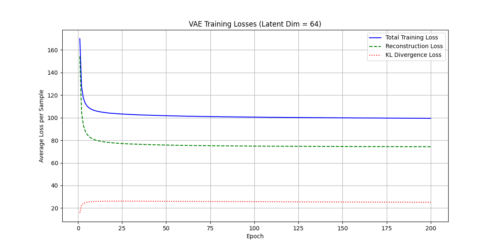
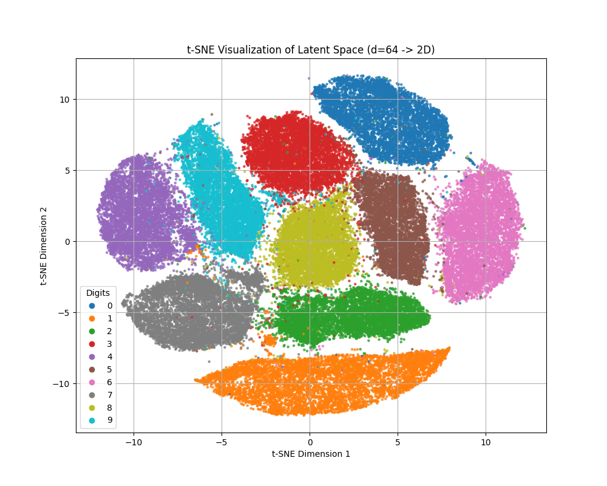

# VAE on MNIST

A simple Variational Autoencoder (VAE) implementation using PyTorch for the MNIST dataset. This project explores the effect of different latent dimensions ($d=1, 2, 64$) on reconstruction quality and latent space structure.

## Requirements

Ensure you have Python 3 and pip installed. Then, install the required libraries:

```bash
pip install torch torchvision numpy matplotlib scikit-learn tqdm
```

## Usage

### Training and Evaluation

*   **Train with specific latent dimensions (e.g., d=1, d=2):**
    The `main.py` script trains VAE models with specified latent dimensions. Generated images (reconstructions, samples) and latent space plots (for $d \ge 2$) are saved in the `./images/z{dim}/` directory.
    ```bash
    # Example: Train with latent_dim=1 (modify main.py if needed to set dim)
    python main.py 
    ```

*   **Find Minimum Loss (d=64):**
    The `min_loss.py` script is configured to train the VAE with $d=64$ (aiming for the best reconstruction) and saves the results.
    ```bash
    python min_loss.py
    ```
    This script trains the model, logs the minimum validation loss achieved, and saves the loss curve (`loss.jpg`) and a t-SNE visualization of the latent space (`z64.png`) in the project root directory.

## Results (d=64)

Running `python min_loss.py` trains the model with a latent dimension of 64.

*   **Minimum Total Validation Loss Achieved:** $100.35$

*   **Visualizations:**

    | Loss Curve (d=64)                      | Latent Space (d=64, t-SNE)                 |
    | :------------------------------------: | :----------------------------------------: |
    |  |  |

## Project Structure

```
.
├── data/             # MNIST dataset (downloaded automatically)
├── images/           # Saved images (reconstructions, samples, plots)
│   ├── z1/
│   ├── z2/
│   └── z64/          # (Potentially created by min_loss.py or main.py)
├── model/            # VAE model definition and helper functions
│   ├── __init__.py
│   └── vae.py
├── report/           # LaTeX report files
│   ├── template.tex
│   └── ...
├── main.py           # Main script for training (e.g., d=1, d=2)
├── min_loss.py       # Script focused on training d=64 for best loss
├── loss.jpg          # Loss curve plot for d=64 (output of min_loss.py)
├── z64.png           # Latent space plot for d=64 (output of min_loss.py)
└── README.md         # This file
```